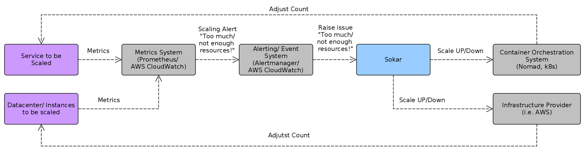

# Sokar

   

## Overview

### Purpose

_Sokar is a generic alert based auto-scaler for cloud systems._

If you are running your microservices on a container orchestration system like [Nomad](https://www.nomadproject.io) or [kubernetes](https://kubernetes.io), then you are probably also need to scale them based on the load varying over time. The same situation applies if your system runs directly on AWS EC2 instances and thus they have to be scaled out with increased and scaled in with a reduction of the load. Usually the decision to scale is made based on metrics like current CPU/ RAM utilization or requests per second. But often you might want to use custom metrics like the length of a job-queue, the number of processed images per second or even a combination of those.

Here comes sokar into play. Sokar is a generic auto-scaler that makes scale up/ down decisions based on [scale alerts](doc/ScaleAlerts.md). He constantly evaluates the incoming scaling alerts, aggregates them and then scales the desired `ScaleObject` (i.e. microservice or an EC2 instance). Even if multiple metrics shall be taken into account for scaling the `ScaleObject`, those metrics just have to be expressed as scaling alerts and sokar will use them accordingly for scaling.

### Benefit

1. Possibility to combine multiple metrics to be taken into account for the scaling decisions. The impact of those metrics, expressed as [scale alerts](doc/ScaleAlerts.md), can be easily adjusted by configuring suitable weights.
2. Use the connectors to scale the actual `ScaleObject`. No need to implement the communication with the Container Orchestration System in this regard. The supported connectors can be found [here](doc/Connectors.md).
3. Configurable and ready to use capacity planning, providing separate cool downs for up and down scaling. Further more it is possible to select the [planning mode](doc/PlanningMode.md) which fits best for your workload.

### State

At the moment sokar is able to **scale Nomad jobs** and **AWS EC2 instances**.
For details about the changes see the [changelog](CHANGELOG.md).

## Build and Run

run on nomad, run for ASG

## Links

- For configuration see [Config.md](config/Config.md)
- For metrics see [Metrics.md](Metrics.md)
- Example Grafana dashboards can be found at [Dashboards.md](dashboards/Dashboards.md)
- Structure and components of sokar are described at [Components.md](doc/Components.md)
