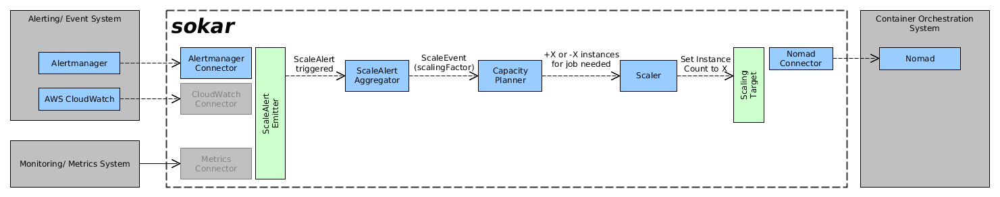

# Components

## Overview

As input sokar gets either directly events/ alerts that correlate to a scale up/ -down event (scale event) or just metrics from a monitoring system. Based on this metrics sokar itself then can decide whether a scale event should be generated.

Using this input data sokar decides what to do. Based on the current situation sokar then either scales up the scaling-object (container or data-center node) running on the container orchestration system using its api.

## ScaleEventGenerator (SEG)

- Responsible to generate events which are relevant for scaling.
- These events are either up or down events.
- The event is triggered in case:
  - An overrun threshold for a relevant metric has been met for a certain amount of time.
  - An underrun threshold for a relevant metric has been met for a certain amount of time.
- The event is fired as long as the metrics met the according threshold.
- The event is "resolved"/ not fired any more as soon as the according threshold is not met any more.

## ScaleEventEvaluator (SEE)

- Responsible to combine/ convert several scale events to a scale up or scale down decision.
- The decision is made each time the event situation changed. A hysteresis is not applied here. This means if a scale up event has vanished because the metric is not above the threshold any more, the SEE could revert his decision to scale up immediately.
- The evaluation is based on the actual rules defined for the specific scaling-object.
- The rules define which events are relevant for scaling up and down. Potentially even only combination of several events could lead to a scale up decision.

## CapacityPlanner (CAP)

The CapacityPlanner is responsible to decide how many instances/ allocations of the scaling-object shall be deployed at a certain point in time.
Details about the CapacityPlanner can be found [here](CapacityPlanner.md).

## Scaler (SCA)

- Responsible to know the current state/ amount of running instances of the scaling-object.
- Responsible to scale the scaling-object using the api of the container orchestration system.
