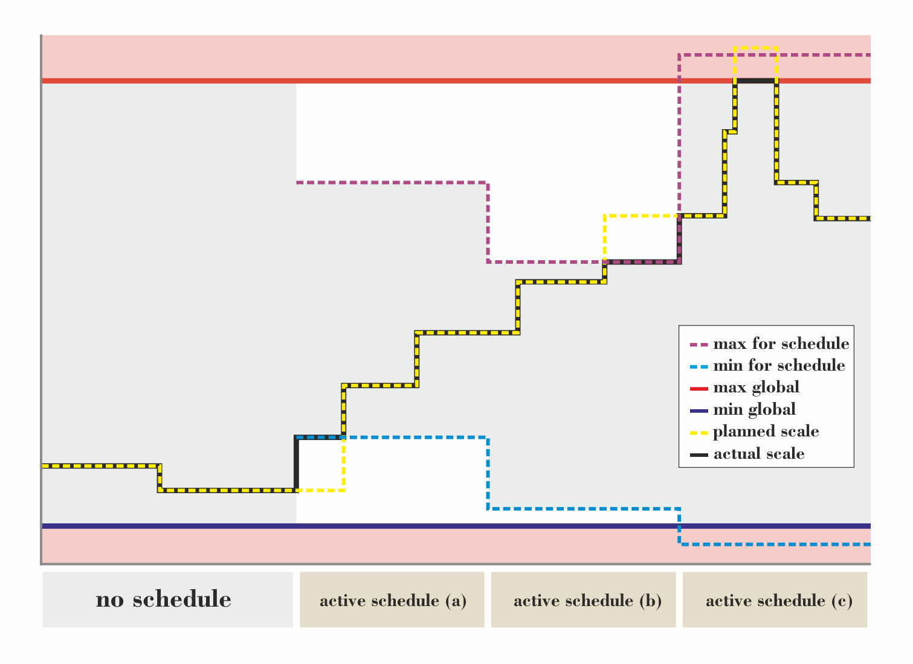

# Scheduled Scaling

## Overview

- Definition of scheduled scaling
- How does sokar behave when scheduled scaling is active
- How to configure scheduled scaling
- Example configurations

## What is Scheduled Scaling?

### Background

Scheduled scaling is intended for scenarios where the load is roughly known beforehand and where this load is present in a repeating manner (e.g. each day). If this a-priori knowledge is incorporated into the automatic scaling one can imagine that it would improve the scaling reliability of the system. Furthermore, instead of just reacting on the scaling alerts caused by the current load it is possible to prepare the application for the incoming requests by prescaling the system.

### Behavior and Implementation

With scheduled scaling sokar introduces a way to define at which time span what `scale range` is allowed. A scale range is a pair of limit values, a `min`- and a `max` scale. The time span (within one day) is defined by a `start`, an `end`. The `day(s)` for which the values shall be applied can also be specified. These three components (`day`, `time` and `scale range`) form a so called `scheduling entry`. Then multiple `schedule entries` define a complete `schedule`.



In general, for the time one `schedule entry` is active, sokar ensures that the scale is at least `min` and at most `max`. Between those two limits sokar will scale according to the incoming scale alerts. This fact is depicted in the image above. As shown the defined `min` (blue dashed line) and `max` (red dashed line) for the active schedules keep the scale (actual scale, black line) in the specified `scale range`. Even though the planned scale (yellow dashed line) differs at some points. As shown, sokar will scale only in between the grey marked area.

For example in the `active schedule (a)` sokar would like to scale down since there is currently no load on the system, but the defined `min` scale for that schedule permits to do so. The same can happen for scaling up. In `active schedule (b)` sokar want's to scale up to satisfy to the currently high demands on the application but the `max` scale defined for that schedule permits this too.
To summarize one can prescale the system by defining an appropriate `min` scale and can limit the costs based on daytime by selecting the according value for `max`.

If the `min` or `max` is not known or the according limitation in automatic scaling is not wanted, it is possible to just not define the `min`/ `max` bounds.

The picture above shows also another important fact to keep in mind - there is also a global `min` (solid blue line) and `max` limit (solid red line). Global means that it has higher priority than the limits defined for a schedule. This means even if the `min`/ `max` of the schedule is lower/ higher than the globally defined `min`/ `max`, just the global one is finally regarded.
_Hint: The global limits are specified on the scale-object level (see: `--scale-object.min` and `--scale-object.max` in [Config.md](../config/Config.md))_. For example in `active schedule (c)` sokar planned to scale up but the global `max` limit permitted to do so although the `max` for the schedule is high enough.

### No Replacement of Auto Scaling

It is possible to specify a `scale range` where `min` and `max` are identical. Thus it is possible to tie the scale sokar shall ensure to a fixed and exact value at a certain time. But the feature of scheduled scaling is not meant to be used as a replacement for the alert based auto scaling. Furthermore the schedule is not evaluated as frequent enough (just every `30s`) to have fast reaction times for scaling. The time accuracy for scheduled scaling is `1min +-30s`.

## Configuration

The scheduled scaling is active as soon as a scaling schedule is configured. As usual this can be done via environment variable, via command line parameter or configuration file. For details see the description of `scale-schedule` in [Config.md](../config/Config.md).

### Examples

#### ENV vs CMD-Line vs Cfg-File

##### ENV

`export SK_CAP_SCALE_SCHEDULE="MON-FRI 7 9 10-30|MON-FRI 14 18 10-30"`

##### CMD-Line

`--cap.scale-schedule="MON-FRI 7 9 10-30|MON-FRI 14 18 10-30"`

##### Cfg-File

```yaml
cap:
  scale-schedule:
    - days: "MON-FRI"
      start-time: 7:00
      end-time: 9:00
      min: 10
      max: 30
    - days: "MON-FRI"
      start-time: 14:00
      end-time: 18:00
      min: 10
      max: 30
```

#### More Examples

##### Rush hour peaks

- Scale up at weekdays during 7:30-9:30 and 15:30-17:30.
- No schedule in between and on weekends.

###### ENV/ CMD-Line

`MON-FRI 7:30 9:30 10-30|MON-FRI 15:30 17:30 10-30`

###### Cfg-File

```yaml
cap:
  scale-schedule:
    - days: "MON-FRI"
      start-time: 7:30
      end-time: 9:30
      min: 10
      max: 30
    - days: "MON-FRI"
      start-time: 15:30
      end-time: 17:30
      min: 10
      max: 30
```

##### Low Scale at Weekend

- Scale down at weekends during the whole day.
- No schedule for weekdays

###### ENV/ CMD-Line

`SAT-SUN * * 2-10`

###### Cfg-File

```yaml
cap:
  scale-schedule:
    - days: "SAT-SUN"
      start-time: "*"
      end-time: "*"
      min: 2
      max: 10
```

##### Prescale, but don't limit the maximum scale

- To be prepared for 'Black Friday' ensure that the system can handle the incoming spike of requests.
- Not knowing the peak amount of requests for that time, don't limit the system from up scaling.
- Starting at 7 and keep it until midnight.

###### ENV/ CMD-Line

`FRI 7 * 20-*`

###### Cfg-File

```yaml
cap:
  scale-schedule:
    - days: "FRI"
      start-time: 7
      end-time: "*"
      min: 20
      max: *
```

##### Full week

- Scale up at weekdays at lunch for 2h.
- Modest scale at remaining day time at weekdays.
- Scale down at weekend.

###### ENV/ CMD-Line

`MON-FRI * 11:59 5-10|MON-FRI 12 14 10-30|MON-FRI 14:01 * 5-10|SAT-SUN * * 2-5`

###### Cfg-File

```yaml
cap:
  scale-schedule:
    - days: "MON-FRI"
      start-time: "*"
      end-time: 11:59
      min: 5
      max: 10
    - days: "MON-FRI"
      start-time: 12:00
      end-time: 14:00
      min: 10
      max: 30
    - days: "MON-FRI"
      start-time: 14:01
      end-time: "*"
      min: 5
      max: 10
    - days: "SAT-SUN"
      start-time: "*"
      end-time: "*"
      min: 2
      max: 5
```
